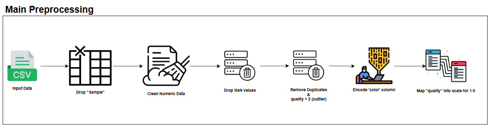
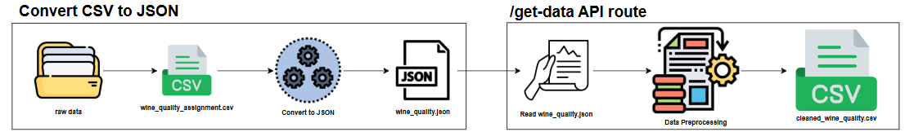
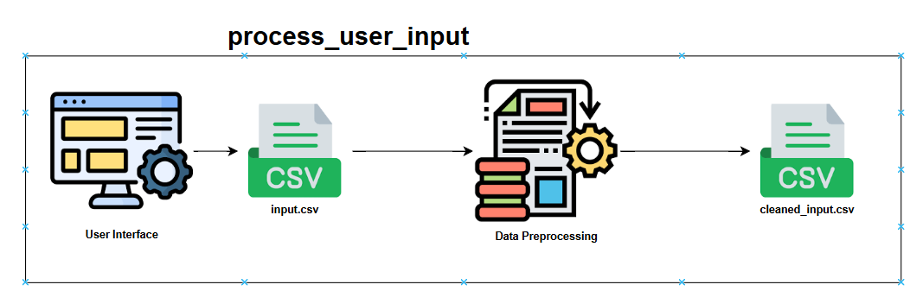
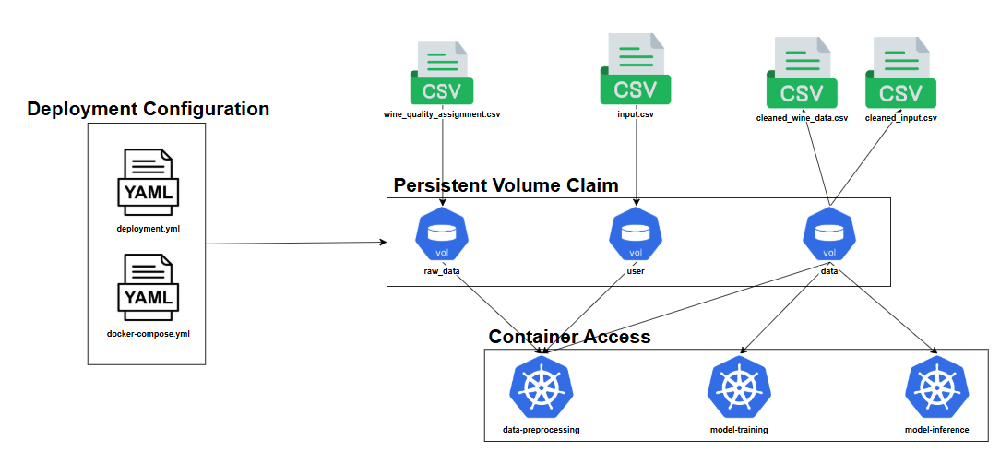

# **EGT309 AI Solution Development Project**

## Project: Determine Wine Quality
This project is a Kubernetes-based machine learning system to determine wine quality in a fully containerized enviornment with persistent storage, as well as a user-friendly web interface

## System Architecture
- Data Preprocessing: Cleans & Transform raw data
- Model Training: Trains a predictive model using Machine Learning
- Model Inference: use the trained model to make predictions
- User Interface: web application for user to interact

## Deployment Containers & Services

### Data Preprocessing
- Description: Clean and transform raw CSV data
- Deployment YAML: data-preprocessing-deployment.yaml
- Service YAML: data-preprocessing-servicce.yaml

### Model Training
- Description: Train ML model using cleaned data
- Deployment YAML: model-training-deployment.yaml
- Service YAML: N/A

### Model Inference
- Description: Used trained model to predict wine quality
- Deployment YAML: model-inference-deployment.yaml
- Service YAML: model-inference-service.yaml

### User Interface:
- Description: Provides an interactive web app
- Deployment YAML: user-interface-deployment.yaml
- Service YAML: user-interface-service.yaml

## File Structure
📦AISDP-Project

┣ 📂.github

 ┃ ┗ 📂workflows

 ┣ 📂backup data

 ┣ 📂data-preprocessing

 ┃ ┣ 📂data

 ┃ ┣ 📂raw_data

 ┃ ┃ ┗ 📜wine_quality_assignment.csv

 ┃ ┣ 📂__pycache__

 ┃ ┣ 📜data_preprocessing.dockerfile

 ┃ ┣ 📜preprocess.py

 ┃ ┗ 📜requirements.txt

 ┣ 📂k8s

 ┃ ┣ 📜data-preprocessing-deployment.yaml

 ┃ ┣ 📜data-preprocessing-service.yaml

 ┃ ┣ 📜model-inference-deployment.yaml

 ┃ ┣ 📜model-inference-service.yaml

 ┃ ┣ 📜model-training-deployment.yaml

 ┃ ┣ 📜pvc.yaml

 ┃ ┣ 📜raw-data-pvc.yaml

 ┃ ┣ 📜user-interface-deployment.yaml

 ┃ ┗ 📜user-interface-service.yaml

 ┣ 📂kubernetes

 ┣ 📂mnt

 ┃ ┣ 📂models

 ┃ ┣ 📂raw_data

 ┃ ┗ 📂user

 ┣ 📂model-inference

 ┃ ┣ 📜inference.py

 ┃ ┣ 📜model_inference.dockerfile

 ┃ ┗ 📜requirements.txt

 ┣ 📂Model-Training

 ┃ ┣ 📂redundant

 ┃ ┣ 📜model_training.dockerfile

 ┃ ┣ 📜requirements.txt

 ┃ ┗ 📜train_model.py

 ┣ 📂raw_data

 ┣ 📂user-interface

 ┃ ┣ 📂assets

 ┃ ┃ ┣ 📂css

 ┃ ┃ ┗ 📂js

 ┃ ┣ 📂static

 ┃ ┃ ┣ 📂css

 ┃ ┃ ┃ ┗ 📜style.css

 ┃ ┃ ┗ 📂js

 ┃ ┃ ┃ ┗ 📜script.js

 ┃ ┣ 📂templates

 ┃ ┃ ┣ 📜index.html

 ┃ ┃ ┣ 📜model_pred_csv.html

 ┃ ┃ ┗ 📜model_pred_manual.html

 ┃ ┣ 📜requirements.txt

 ┃ ┣ 📜web_application.dockerfile

 ┃ ┗ 📜winequality_app.py

 ┣ 📂volumes

 ┃ ┣ 📂data

 ┃ ┃ ┣ 📜.DS_Store

 ┃ ┃ ┣ 📜cleaned_wine_quality.csv

 ┃ ┃ ┗ 📜wine_quality.json

 ┃ ┣ 📂models

 ┃ ┃ ┗ 📜saved_model.pkl

 ┃ ┣ 📂user

 ┃ ┃ ┣ 📜cleaned_input.csv

 ┃ ┃ ┣ 📜input.csv

 ┃ ┃ ┗ 📜predictions.json

 ┃ ┣ 📂userinput

 ┃ ┗ 📜.DS_Store

 ┣ 📜.DS_Store

 ┣ 📜REAME.md

 ┗ 📜run.sh
 

## Data Preprocessing Container (data-preprocessing)
### Overview

The Data Preprocessing COntainer is designed to clean the raw CSV file from the training data and user input data (uploading a CSV or manual input through the UI)

Steps:
- Drop Unnecessary Columns
- Drop NaN values
- Drop Duplicates
- Format Numeric columns
- Encode categorical features
- Map target labels to a specific scale
- Prepare cleaned dataset for other tasks in the pipeline

This container is important in ensuring quality and consistent data in this pipeline.

### File Structure
┣ 📂data-preprocessing

┃ ┣ 📂data

┃ ┣ 📂raw_data

┃ ┃ ┗ 📜wine_quality_assignment.csv

┃ ┣ 📂__pycache__

┃ ┣ 📜data_preprocessing.dockerfile

┃ ┣ 📜preprocess.py

┃ ┗ 📜requirements.txt

### Project Architecture
This section is deployed in a Kubernetes environment with the following configuration
- Deployment Configuration (defined in data-preprocessing.yaml)
    - /app/volumes/data: store cleaned dataset
    - /app/volumes/user: holds user related data

- Service Configuration (defined in data-preprocessing-service.yaml)
    - exposes the Data Preprocessing service at http://data-preprocessing-service:5004, which allows other containers to access it

- Volume Mounts
    - /app/volumes/data pushed to data-volume-pvc to store cleaned dataset
    - /app/volumes/user pushed to user-volume-pvc to store user uploaded data

### Data Flow Diagram

### Features & Functionalities
**Main Preprocessing Steps**
- Training data "wine_quality_assignment.csv" was retrieved from the "raw_data" folder
- Dropped "Sample" column
- Dropped NaN values, duplicates, outliers
- Format numeric columns to ensure correct data types
- Encode categorical features (White - 0, Red - 1)
- Maps "quality" from 1 to 5

**User Input Methods**
- CSV input: user can upload a CSV file through the UI, which is sent fromt he <code>/upload_csv</code> route
- Manual input: user can manually enter the wine features through the UI

**Output from Data Preprocessing**

Cleaned datasets saved in /app/volumes/data or /app/volumes/user as:
- cleaned_wine_quality.csv
- cleaned_input.csv

### preprocess.py
This script handles data preprocessing using Flask API
- /get-data: preprocess the training dataset and saves the cleaned version
- /process-user-input: preprocess the data uploaded by the user and save it as cleaned_input.csv

**convert_csv_to_json()**: convert raw CSV to JSON

**clean_column(column)**: define cleaning numeric columns by removing non-numeric characters

**preprocess_data_logic(df)**: main preprocessing function

### data_preprocessing.dockerfile
- Base Image: <code>python:3.9-slim</code>
- Steps:
    - install dependencies from <code>requirements.txt</code>
    - set up necessary directories for volume mount
    - expose port 5004 for API
    - start Flask application using "python preprocess.py" command

